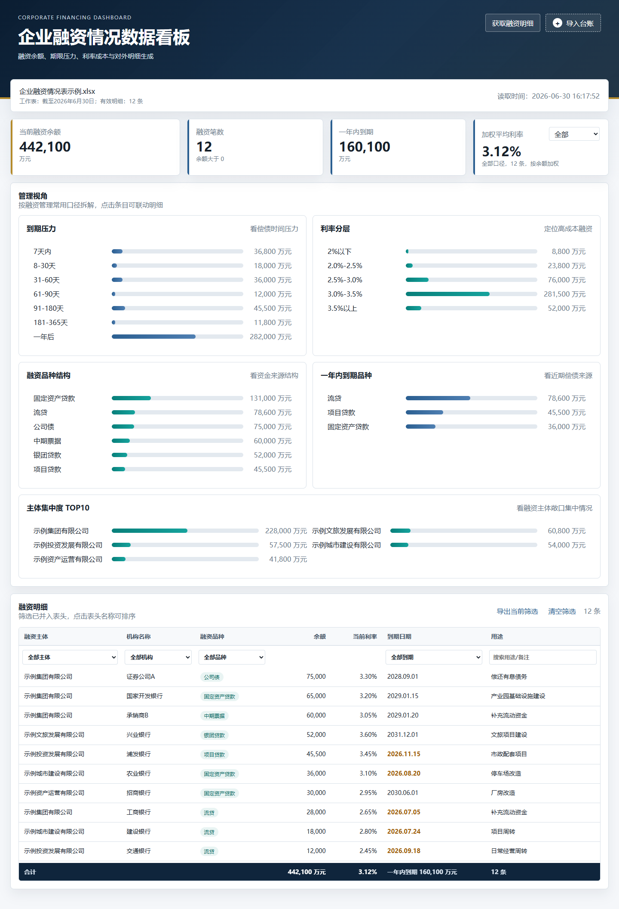

# 企业融资情况数据看板

一个面向企业融资管理的本地/局域网数据看板。管理员在服务端上传最新“融资情况表”后，同一局域网内的同事打开浏览器地址即可查看融资余额、到期压力、融资品种结构、利率成本和融资明细。

> 适合场景：融资台账由人工维护，团队希望有一个低门槛、可局域网共享、数据不上传外网的看板页面。



## About

企业融资情况数据看板会把人工维护的 Excel 融资台账转成浏览器里的实时看板，用于快速查看融资余额、到期压力、融资成本、品种结构和明细筛选结果。项目默认在本机或局域网内运行，业务数据只保存在服务端电脑，不需要上传到外部平台。

## 先看这个

- 运行数据不会提交到 GitHub，`data/`、`uploads/`、日志和打包文件都已被 `.gitignore` 排除。
- 示例 Excel 位于 [samples/企业融资情况表示例.xlsx](samples/企业融资情况表示例.xlsx)，里面是虚构数据，仅用于演示字段格式。
- 推荐入口是 `start.bat`，启动后会在 Windows 右下角显示托盘图标。
- 服务默认端口是 `8780`，局域网访问格式是 `http://服务端电脑IP:8780`。

## 下载安装

### GitHub Release 用户

1. 在 GitHub Releases 页面下载 `corporate-financing-dashboard-版本号.zip`。
2. 解压到服务端电脑的任意目录。
3. 双击 `start.bat`。
4. 右键右下角 `Corporate Financing Dashboard` 托盘图标，打开局域网地址或复制局域网地址。
5. 在页面右上角“导入台账”上传最新融资情况表。

### 从源码运行

```bat
git clone https://github.com/YihanCell/corporate-financing-dashboard.git
cd corporate-financing-dashboard
pip install -r requirements.txt
start.bat
```

如果换电脑运行，请确认那台电脑已经安装 Python 3，并执行过 `pip install -r requirements.txt`。

## 使用方式

### 1. 启动服务

双击：

```bat
start.bat
```

右下角会出现 `Corporate Financing Dashboard` 托盘图标。右键图标可以：

- 查看服务状态
- 启动、停止、重启服务
- 打开本机看板
- 打开局域网看板
- 复制局域网地址
- 开启或关闭开机自启
- 查看当前设置

### 2. 上传融资情况表

在服务端电脑打开页面后，点击右上角“导入台账”，上传最新的融资情况表。

系统会读取 Excel 的第二个工作表，一般名称类似：

```text
截至2026年6月30日
```

这个工作表至少需要包含以下字段：

```text
融资主体
机构名称
融资品种
贷款余额（万元）
到期日期
```

### 3. 发给同事访问

服务端上传一次后，同事不需要再上传 Excel。直接打开局域网地址即可，例如：

```text
http://10.1.30.183:8780
```

## 示例数据

仓库提供了一个可直接导入的示例表：

[samples/企业融资情况表示例.xlsx](samples/企业融资情况表示例.xlsx)

示例表包含流贷、固贷、项目贷款、银团贷款、公司债、中期票据、不同到期区间、不同利率区间和不同融资主体。它只用于演示字段结构和看板效果，不包含真实业务数据。

## 功能概览

- 当前融资余额、融资笔数、一年内到期金额
- 加权平均融资成本：全部、债券、流贷、固贷、贷款、三年及以下、三年以上
- 到期压力：已到期、7天内、8-30天、31-60天、61-90天、91-180天、181-365天、一年后
- 利率分层、融资品种结构、一年内到期品种、主体集中度 TOP10
- 明细筛选、排序、合计
- 导出对外融资明细
- 导出当前筛选后的融资明细

## 导出说明

顶部按钮“获取融资明细”用于导出对外提供的融资明细，内容包含融资主体、机构名称、融资品种、贷款余额、到期日期，并会排除公司债、企业债、债券、中期票据等债券类内容。

明细表右上角“导出当前筛选”用于导出当前页面筛选后的完整明细。导出的 Excel 会包含当前筛选结果，并在最后增加合计行。

## 数据与代码分离

以下运行数据不会提交到 GitHub：

```text
uploads/
data/
*.log
__pycache__/
dist/
```

当前看板数据会优先保存到：

```text
data/current_payload.json
```

如果服务进程没有权限写入项目 `data` 目录，会自动使用后备位置：

```text
C:\tmp\corporate-financing-dashboard\current_payload.json
```

## 发布打包

维护者可以用脚本生成 Release zip：

```powershell
powershell -ExecutionPolicy Bypass -File scripts/package_release.ps1 -Version v0.3.2
```

输出文件：

```text
dist/corporate-financing-dashboard-v0.3.2.zip
```

这个 zip 可以上传到 GitHub Release，供同事下载解压使用。

## 常见问题

### 同事打不开局域网地址

先确认服务端电脑能打开：

```text
http://127.0.0.1:8780
```

如果本机能打开、同事打不开，通常是防火墙或网络问题。可以尝试：

1. 右键托盘图标，复制当前局域网地址，确认同事访问的是服务端当前 IP。
2. 运行 `scripts/windows/allow_lan_access_8780.bat`。
3. 确认同事和服务端电脑在同一局域网。

### 页面显示尚未上传数据

说明服务端还没有当前融资情况表缓存。管理员在服务端页面上传一次最新融资情况表即可。

### 上传后没有变化

请确认上传的是融资情况表，并且第二个工作表字段符合示例表结构。可以先用 [samples/企业融资情况表示例.xlsx](samples/企业融资情况表示例.xlsx) 测试。

## 文件结构

```text
README.md                         项目说明
requirements.txt                  Python 依赖
server.py                         后端服务、Excel 解析、导出接口
start.bat                         推荐启动入口
stop.bat                          停止服务
static/                           前端页面、样式和交互
samples/企业融资情况表示例.xlsx    示例融资情况表
docs/images/dashboard-sample.png  README 截图
docs/release-notes/               Release 说明
scripts/package_release.ps1       Release 打包脚本
scripts/create_sample_workbook.py 生成示例 Excel
scripts/capture_readme_screenshots.mjs 生成 README 截图
scripts/windows/                  Windows 辅助脚本
```
